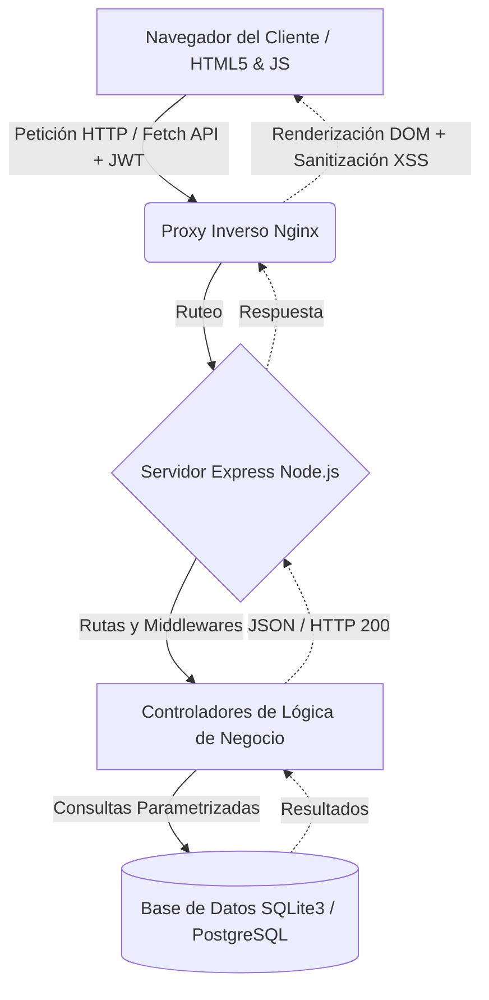

# Cervantes Asociados — Sistema de Gestión de Casos Legales

## Resumen Ejecutivo

### Descripción
**Cervantes Asociados** es una plataforma integral para la administración y seguimiento de expedientes legales, diseñada a la medida para modernizar el flujo de trabajo de la firma de abogados.

### El Problema
Históricamente, la firma ha dependido de herramientas fragmentadas como hojas de cálculo en **Excel** y mensajería a través de **WhatsApp** para dar seguimiento a los casos, compartir actualizaciones con clientes y administrar las tareas. Esto generaba inconsistencia de datos, cuellos de botella en la comunicación y vulnerabilidades de seguridad en la información confidencial.

### La Solución
El Sistema de Gestión de Casos Legales centraliza la administración de los expedientes. Proporciona un entorno seguro basado en roles, búsquedas eficientes de clientes y casos, métricas automatizadas (estadísticas) y trazabilidad completa de estatus. Todo a través de una interfaz web moderna, responsiva y fácil de usar, eliminando por completo la dependencia del software ofimático manual y los grupos de WhatsApp.

### Arquitectura General
El proyecto adopta un modelo cliente-servidor clásico:
- **Cliente Web**: Frontend SPA servido con HTML5, CSS3, y Vanilla JavaScript, comunicándose mediante Fetch API de manera asíncrona.
- **Servidor (Backend)**: API RESTful construida con Node.js 18 LTS y Express 4.x.
- **Base de Datos**: SQLite 3 (para fases tempranas, desarrollo y pruebas) escalable a PostgreSQL para producción.
- **Proxy Inverso**: Diseñado para ser desplegado detrás de un Nginx Proxy para manejo de SSL, concurrencia y ruteo seguro en la nube.

---

## Tabla de Contenidos
1. [Resumen Ejecutivo](#resumen-ejecutivo)
2. [Arquitectura Visual](#arquitectura-visual)
3. [Requerimientos e Instalación](#requerimientos-e-instalación)
4. [Uso del Sistema](#uso-del-sistema)
    - [Manual de Usuario Final](#manual-de-usuario-final)
    - [Manual de Administrador](#manual-de-administrador)
5. [Guía de Contribución](#guía-de-contribución)

---

## Arquitectura Visual

A continuación se muestra el flujo de datos y la arquitectura del sistema:



---

## Requerimientos e Instalación

### Requisitos Previos
- **Node.js**: v18.x LTS (obligatorio).
- **NPM**: v8.x o superior.
- **Git**

### Entorno de Desarrollo (Local)
1. Clona el repositorio:
   ```bash
   git clone https://github.com/tu-usuario/cervantes-asociados.git
   cd cervantes-asociados
   ```
2. Instala las dependencias del proyecto utilizando *clean install* para evitar divergencias de paquetes:
   ```bash
   npm ci
   ```
3. Inicializa la base de datos de desarrollo (este comando creará el archivo SQLite, las tablas y poblará los datos semilla de prueba):
   ```bash
   npm run db:init
   ```
4. Ejecuta la suite de pruebas para verificar la integridad:
   ```bash
   npm test
   ```
5. Ejecuta el servidor:
   ```bash
   npm start
   ```
6. Accede a la aplicación desde el navegador: `http://localhost:3000`

### Entorno de Nube (Producción sugerida)
1. Instalar **Node 18** y **Nginx** en un VPS (Ej. AWS EC2, DigitalOcean, Linode).
2. Configurar el proxy inverso Nginx apuntando al puerto `3000` del proceso local de Node (idealmente manejado por `PM2`).
3. Asegurar los endpoints utilizando certificados SSL (Let's Encrypt / Certbot).
4. Configurar variables de entorno exportando un `JWT_SECRET` seguro y transicionar el driver de base de datos de SQLite a PostgreSQL en `src/database/db.js`.

---

## Uso del Sistema

### Manual de Usuario Final (Rol Abogado)
- **Acceso:** Ingresa al sistema en `/login.html` con tus credenciales. Tu JWT se almacenará temporalmente en el `localStorage` del navegador y tiene una validez estricta de 8 horas para proteger tu sesión.
- **Visualización:** Al entrar al Dashboard (la vista principal), verás tarjetas estadísticas consolidadas dinámicamente con base en el estatus de los casos.
- **Búsqueda de Casos:** Puedes ubicar casos escribiendo palabras clave en el buscador. Su sistema *debounce* integrado realizará la búsqueda sin sobrecargar la red.
- **Gestión:** Podrás registrar nuevos casos que autogenerarán un folio inviolable con formato `CA-YYYY-XXXX` y cambiar el estatus de un caso exclusivamente entre las fases permitidas (Abierto, En Progreso, Pausado, Cerrado).

### Manual de Administrador (Rol Administrador)
- **Privilegios (RBAC):** El administrador cuenta con todos los beneficios del usuario final, más el control integral de las entidades secundarias (Clientes y Usuarios).
- **CRUD de Clientes:** A través de la API segura, los administradores son las **únicas personas autorizadas** para registrar clientes (POST), modificar sus datos (PUT) o borrarlos (DELETE). Un usuario con rol Abogado que intente realizar estas acciones recibirá un error de acceso denegado (HTTP 403 Forbidden).

---

## Guía de Contribución

¡Toda ayuda es bienvenida! Para colaborar en el código de Cervantes Asociados, sigue este flujo estricto:

1. **Clonar y Ramificar:**
   Haz un fork del repositorio en GitHub y clónalo localmente. Crea una nueva rama partiendo de `main` nombrando claramente la funcionalidad o reparación:
   ```bash
   git checkout -b feature/nueva-funcionalidad
   # o
   git checkout -b bugfix/falla-auth
   ```

2. **Estándares de Código y Pruebas Locales:**
   Asegúrate de no romper funcionalidades existentes. Se requiere de manera estricta que ejecutes las pruebas automatizadas y confirmes que los **20 test cases de Jest** pasen satisfactoriamente antes de realizar un commit:
   ```bash
   npm test
   ```

3. **Pull Request (PR):**
   Haz commit y sube los cambios a tu rama. Abre un Pull Request (PR) apuntando a la rama `main` del proyecto original. Describe la lógica de tu solución en la descripción del PR.

4. **Integración Continua (Travis CI):**
   Cada PR disparará de forma automática el flujo configurado en `.travis.yml`. Travis instalará el proyecto bajo Node 18, inicializará la base de datos SQLite y correrá la suite de Jest.
   - **Importante:** No se aceptará ningún *merge* si la build en Travis CI marca error. Asegúrate de monitorear tu PR hasta obtener una aprobación verde (Build Passing).
